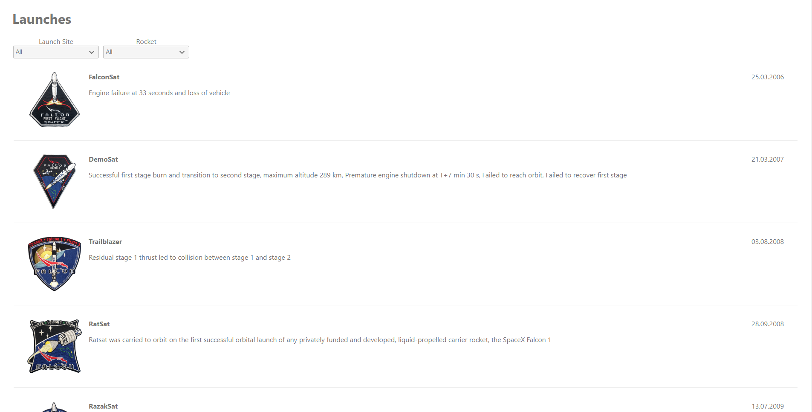

# SpaceX launches

This is a solution for displaying a list of SpaceX launches with the ability to filter the list.

local react-dev:
`cd client && npm run start`

local node-dev:
`cd server && npm run build && npm run start`

main:
`npm run prod`

image:
`docker build .` or [Image on Docker Hub](https://hub.docker.com/r/axvc/launches)

`docker run -p {local-port}:4200 {image}`

## Table of contents

- [Overview](#overview)
    - [The challenge](#the-challenge)
    - [Screenshot](#screenshot)
- [My process](#my-process)
    - [Built with](#built-with)
    - [Useful resources](#useful-resources)

## Overview

### The challenge

Users should be able to:

- View the list of cards containing information about launches
- Filter the list of launches using dropdowns by launch site and rocket

### Screenshot

## My process

### Built with

- [Typescript](https://www.typescriptlang.org/) - FrontEnd Language
- [React](https://reactjs.org/) - FrontEnd Framework
- [Node.js](https://nodejs.org/en/) - BackEnd Language
- [Express](https://expressjs.com/) - BackEnd Framework
- [Docker](https://www.docker.com/) - Containerizing

### Useful resources

- [API](https://api.spacexdata.com/v3/launches)

